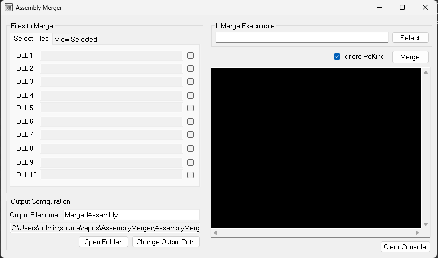
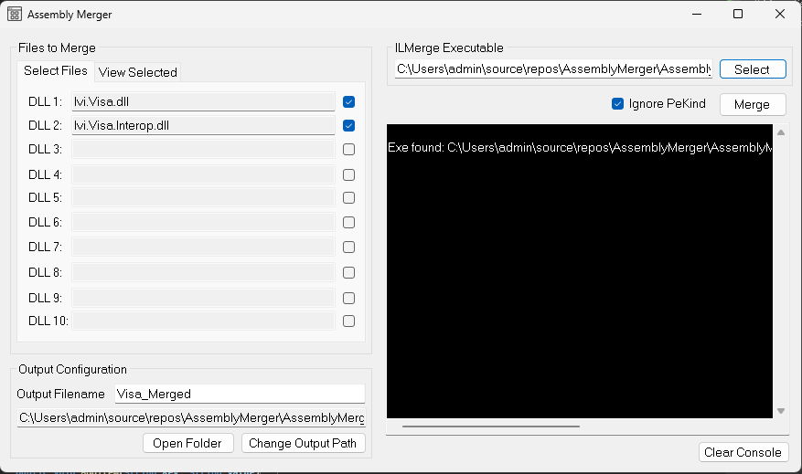

# Assembly Merger



**Assembly Merger** is a Windows Forms application designed to streamline the process of merging multiple .NET assemblies into a single executable or DLL. 
Leveraging [ILMerge](https://github.com/dotnet/ILMerge), this tool provides a user-friendly interface for developers aiming to simplify deployment and reduce assembly clutter.

---

## Features

- **Graphical User Interface**: Intuitive design for easy navigation and operation.
- **Customizable Output**: Specify output paths and filenames effortlessly.
 **Auto-Detection of ILMerge Executable**: Automatically resolves and uses ILMerge.exe from the local application directory.
- **Default Output Directory**: Automatically sets to `ExecutableBaseDirectory\output` for organized storage.
- **Real-time Logging**: Monitor merge operations through an integrated console.
- **Error Handling**: Provides feedback on merge success or failure.

---

## Getting Started

### Prerequisites

- .NET Framework 4.7.2 or higher
- Visual Studio 2019 or later

### Installation

1. Clone the Repository:

   ```bash
   git clone https://github.com/emman-j/assembly-merger.git
   ```

3. Open the Solution:

   Navigate to the cloned directory and open `AssemblyMerger.sln` with Visual Studio.

4. Build the Solution:

   Restore any NuGet packages if prompted and build the solution to ensure all dependencies are resolved.

---

## Usage

1. Launch the Application:

   Run the compiled executable from the `bin\Debug` or `bin\Release` directory.

2. Select Assemblies:

   Use the interface to add the assemblies you wish to merge.

3. Specify Output:

   Choose the desired output directory and filename. By default, the application sets the output path to `ExeDirectory\output`.

4. Merge Assemblies:

   Click the "Merge" button to initiate the process. Monitor the console for real-time feedback.

---

## Screenshot





*Figure: Main interface showcasing assembly selection and merge operations.*


*Figure: Error reporting for easy debugging.*


---

## Acknowledgments

- **ILMerge**: This application utilizes [ILMerge](https://github.com/dotnet/ILMerge) to facilitate the merging of .NET assemblies. ILMerge is developed by Microsoft Research and is available under the MIT License.

---

## License

This project is licensed under the MIT License. See the [LICENSE](LICENSE) file for details.

---

## Contributing

Contributions are welcome! Please fork the repository and submit a pull request for any enhancements or bug fixes.
